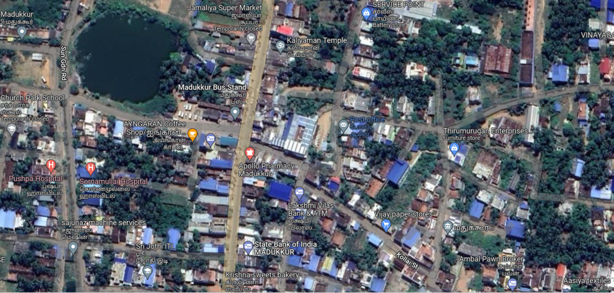

# Places Around Me
# Aim:
To develop a website to display details about the places around my house.

# Design Steps:
## Step 1
Clone the github repository into Theia IDE.
## Step 2
Create a new Django project.
## Step 3
Write the html code .
## Step 4
Run the Django server and execute the HTML files..

# Code:
HTML code:
```

<!DOCTYPE html>
    <html lang="en">
        <head>
            <title>MY CITY</title>
            <meta charset='utf-8'>
            <meta http-equiv='X-UA-Compatible' content='IE=edge'>
            <meta name='viewport' content='width=device-width, initial-scale=1'>  
        </head>
        <body>





<map name="image-map">
    <area target="_self" alt="BUS STAND" title="BUS STAND" href="Busstand.html" coords="738,285,130" shape="circle">
        <area target="_self" alt="COFFEE SHOP" title="COFFEE SHOP" href="ayngarancoffee.html" coords="516,429,126" shape="circle">
    <area target="_self" alt="SBI BANK" title="SBI BANK" href="sbi.html" coords="861,796,130" shape="circle">
    <area target="_self" alt="APOLLO" title="APOLLO" href="apollopharmacy.html" coords="739,468,893,547" shape="rect">
    <area target="_self" alt="POST OFFICE" title="POST OFFICE" href="postoffice.html" coords="1046,349,1228,466" shape="rect">
</map>
        </body>
    </html>
```


# Output:

# Result:
 The program for implementing image map is executed successfully.
